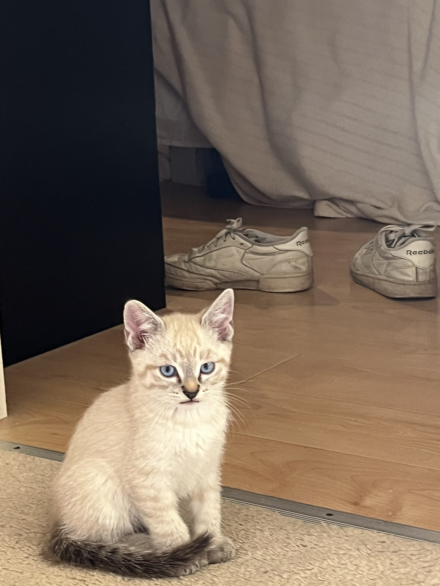

# Aidan Bartlett
Activity: GitHub, Markdown, and HTML - January 14

## About Me
I am a senior at the University of Washington studying Informatics! I'll be graduating at the end of the quarter (winter 2026) and will be starting at Accenture in September as a security analyst. Hopefully I can get a job for those 6 months of free time or maybe I'll travel.

## Hobbies
- Bouldering
- Video games (Siege and Rocket Leauge)

## Favorite classes
- This one!
- [IMT 589 - Offensive security lab](https://owasp.org/www-chapter-vancouver/assets/presentations/2020-02_OWASP_Vancouver_Small.pdf)
- [CSE 415 - Intro to AI](https://courses.cs.washington.edu/courses/cse415/)
- [STAT 416 - Intro to ML](https://courses.cs.washington.edu/courses/cse416/)
- [INFO 441 - Server-side dev](https://github.com/info441-wi21/course_info)

## My Cat!
My cat's name is Papaya! He was a kitten in this picture but he is now ~1.5 years old

